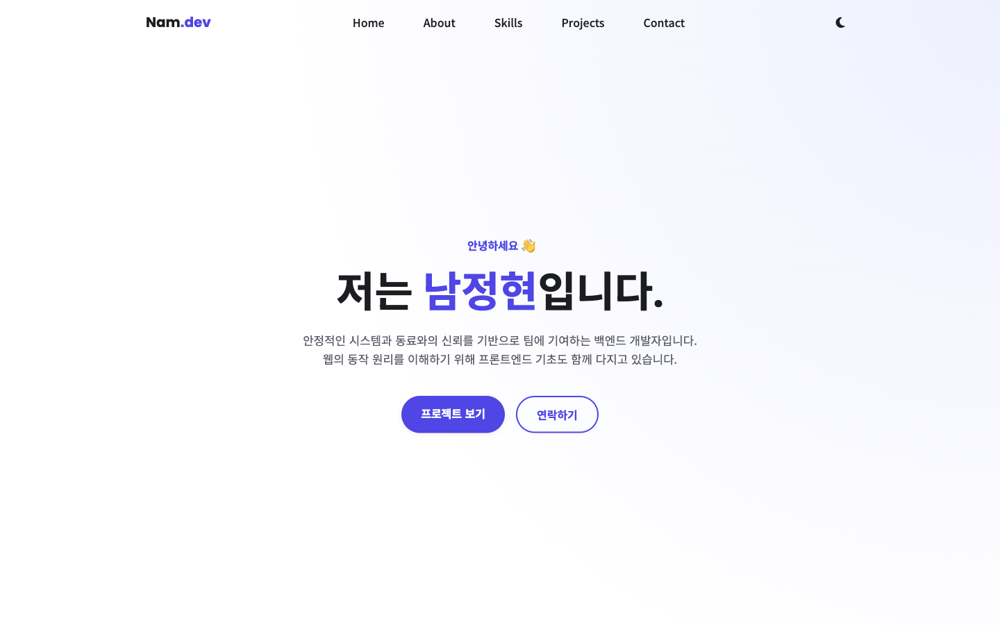
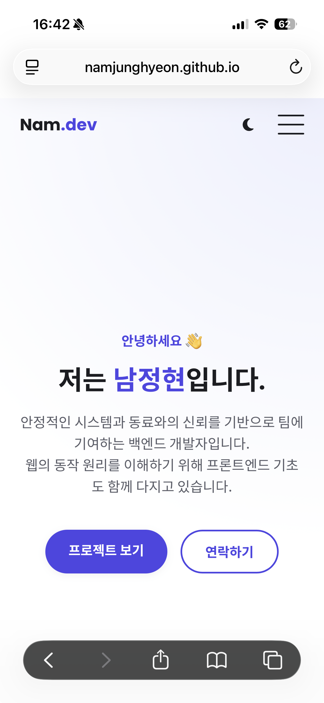
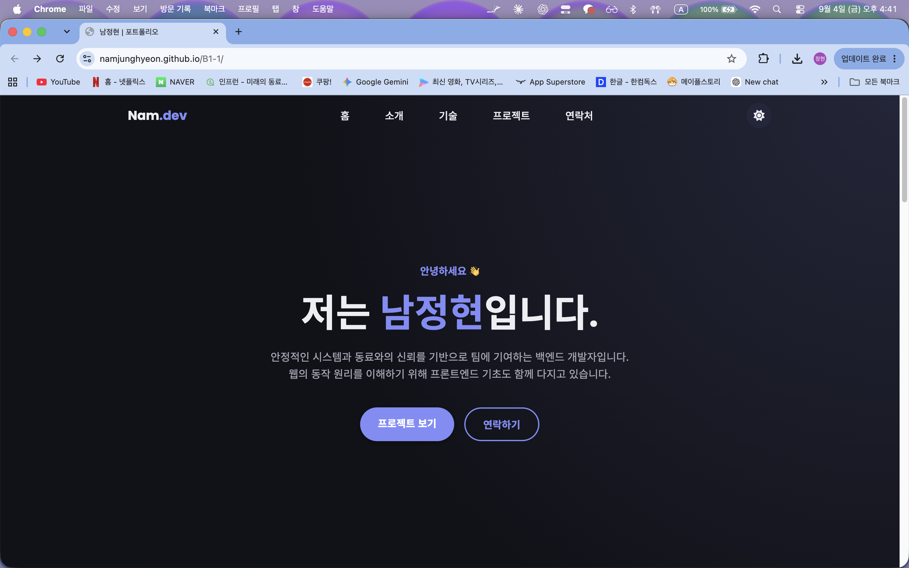

# 남정현 포트폴리오

순수 HTML / CSS / JavaScript로 만든 반응형 개인 포트폴리오 웹사이트입니다.
외부 프레임워크(React, Vue, Bootstrap 등) 없이 시맨틱 마크업, Flexbox/Grid,
바닐라 JS DOM 조작과 GitHub API 연동으로 구현했습니다.

> ⚠️ Contact 폼으로 실제 이메일을 받으려면 아래 "보너스 기능"의 Formspree 설정이 필요합니다.

## 사용 기술

- HTML5 (시맨틱 태그: header, nav, main, section, article, footer)
- CSS3 (CSS 변수, Flexbox, Grid, 미디어 쿼리, 트랜지션)
- Vanilla JavaScript (ES6+, `fetch`/`async-await`, Intersection Observer)
- GitHub REST API (`/users/{username}/repos`)
- Font Awesome (아이콘), Google Fonts (Poppins, Noto Sans KR)

## 배포 URL

- https://namjunghyeon.github.io/B1-1/

## 개인화하기 (배포 전 체크리스트)

| 항목 | 위치 | 상태 |
| --- | --- | --- |
| 이름 / 소개 문구 | `index.html`의 `<title>`, Hero, About 섹션 | 완료 (남정현) |
| GitHub 아이디 | `js/main.js` 최상단의 `GITHUB_USERNAME` 상수 | 완료 (NamJungHyeon) |
| 이메일 | `index.html`의 Footer 섹션 | 완료 (nam9490@gmail.com) |
| 기술 스택 목록 | `index.html`의 Skills 섹션 | 완료 (백엔드 위주) |
| 프로필 사진 | `images/profile.png` | 완료 |
| LinkedIn 링크 | `index.html`의 Footer 섹션 | 완료 |
| Formspree 엔드포인트 (보너스: 실제 폼 전송) | `js/main.js`의 `FORMSPREE_ENDPOINT` 상수 | 미설정 (아래 "보너스 기능" 참고) |

## 기준값 (요구사항 명시 사항)

- 스크롤 탑 버튼 노출 기준: 스크롤 300px 이상 (`js/main.js`의 `SCROLL_TOP_THRESHOLD`)
- 네비게이션 배경 변경 기준: 스크롤 60px 이상 (`js/main.js`의 `NAV_SCROLL_THRESHOLD`)
- 스크롤 애니메이션 Intersection Observer threshold: 0.2 (`js/main.js`의 `REVEAL_THRESHOLD`)

## 주요 기능

- 다크 모드 토글 (localStorage에 저장, 새로고침 후에도 유지)
- 모바일 햄버거 메뉴, 부드러운 스크롤 앵커 이동
- 스크롤에 반응하는 네비게이션 스타일 변경 + 맨 위로 이동 버튼
- Intersection Observer 기반 스크롤 등장 애니메이션
- GitHub API로 저장소 목록을 불러와 카드로 렌더링 (로딩 / 성공 / 에러 / 빈 상태 모두 처리)
- Contact 폼 유효성 검사 (필수값, 이메일 형식, 필드별 에러 메시지)

## 보너스 기능

- **프로젝트 언어별 필터링**: GitHub에서 불러온 저장소의 언어를 `array.filter()`로 추출해
  필터 버튼을 만들고, 클릭 시 해당 언어의 저장소만 보여줍니다 (`js/main.js`의 `renderFilters`/`applyFilter`).
- **타이핑 효과**: Hero 섹션의 이름이 한 글자씩 나타납니다 (`js/main.js`의 `setupTypingEffect`).
- **시스템 다크 모드 감지**: `localStorage`에 저장된 설정이 없으면 `prefers-color-scheme`
  미디어 쿼리로 OS 다크 모드 설정을 따라가고, 시스템 설정이 바뀌면 실시간으로 반영합니다.
  사용자가 토글을 한 번이라도 누르면 그 이후로는 수동 설정을 우선합니다 (`js/main.js`의 `initTheme`).
- **폼 실제 전송 (Formspree)**: [formspree.io](https://formspree.io)에 가입해 폼을 만든 뒤,
  `js/main.js` 상단의 `FORMSPREE_ENDPOINT`를 본인 폼 URL로 교체하면 Contact 폼 제출 시
  실제로 이메일을 받을 수 있습니다. 설정 전에는 로컬에서 성공 메시지만 보여주는 데모 모드로 동작합니다.

## 로컬 실행

VS Code의 Live Server 확장으로 `index.html`을 열거나, 아래 명령으로 정적 서버를 띄웁니다.

```bash
cd portfolio
python3 -m http.server 5500
```

브라우저에서 `http://localhost:5500` 접속.

## GitHub Pages 배포

```bash
# portfolio 폴더가 곧 저장소 루트가 되도록 구성한 뒤
git init
git add .
git commit -m "Initial portfolio commit"
git branch -M main
git remote add origin https://github.com/<본인아이디>/<저장소명>.git
git push -u origin main
```

이후 저장소 Settings → Pages → Source를 `main` 브랜치로 지정하면
`https://<본인아이디>.github.io/<저장소명>/` 에서 접속할 수 있습니다.

## 스크린샷

- 데스크톱: 
- 모바일: 
- 다크 모드: 
